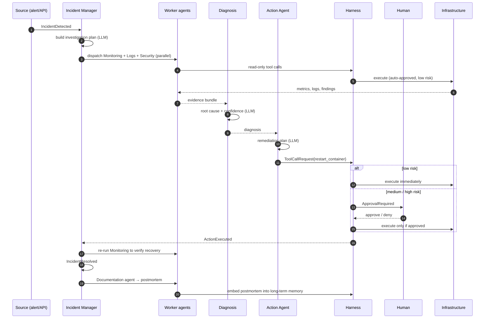

# AegisOps AI — Architecture

> Status: living document. Updated at the end of every phase.
> Phase 1 establishes the layering and the physical environment; later phases
> fill it in.

---

## 1. The problem

An on-call SRE handling an incident performs a loop:

```
observe → hypothesise → gather evidence → diagnose → plan → act → verify → document
```

Most of that loop is bounded reasoning over telemetry, and it is exactly what an
LLM is good at. **Acting is not.** The `act` step is where a mistaken inference
becomes a deleted database.

AegisOps AI automates the whole loop while making the `act` step structurally
incapable of being driven by the model alone.

---

## 2. The central constraint

> **An agent never holds a handle to infrastructure.**

This is not a coding guideline. It is enforced by the dependency graph: the
`internal/agents` package has no import path — direct or transitive — that
reaches a Docker client, a Kubernetes client, or an SSH session. It cannot,
because those clients live behind an interface that only `internal/harness`
implements against.

An agent's most powerful possible output is a **description of an action**:

```go
// internal/domain/harness — pure data. No behaviour, no clients, no network.
type ToolCallRequest struct {
    AgentID    AgentID
    IncidentID IncidentID
    Tool       string            // "docker"
    Action     string            // "restart_container"
    Params     map[string]any    // {"container":"api-7f9"}
    Reason     string            // model's justification, recorded verbatim
    Confidence float64
}
```

If the model hallucinates `"action": "delete_all_volumes"`, the result is a
rejected request in the audit log, not an outage. The blast radius of a model
failure is bounded by the harness, not by the model's good behaviour.

---

## 3. Layering

Clean/hexagonal, mapped onto the agreed folder structure.

```
                    ┌─────────────────────────────────────┐
  DRIVING           │  internal/api      (HTTP, net/http) │
  ADAPTERS          │  cmd/aegisctl      (CLI)            │
                    └──────────────────┬──────────────────┘
                                       │ calls
                    ┌──────────────────▼──────────────────┐
  APPLICATION       │  internal/services  (use cases)     │
                    │  internal/agents    (agentic layer) │
                    │  internal/harness   (control plane) │
                    └──────────────────┬──────────────────┘
                                       │ depends on
                    ┌──────────────────▼──────────────────┐
  CORE              │  internal/domain   (entities)       │
                    │  internal/ports    (interfaces)     │
                    │  ── imports nothing outside stdlib  │
                    └──────────────────▲──────────────────┘
                                       │ implements
                    ┌──────────────────┴──────────────────┐
  DRIVEN            │  repository/postgres  memory/redis  │
  ADAPTERS          │  events/rabbitmq      llm/ollama    │
                    │  tools/docker         tools/k8s     │
                    └─────────────────────────────────────┘
```

**The dependency rule:** arrows point inward. `domain` knows nothing. Adapters
know about `ports`. Nothing above the core knows which adapter is wired in.

What this buys, concretely:

| Swap | Cost |
|---|---|
| Ollama → llama.cpp | one constructor in `cmd/aegisopsd` |
| RabbitMQ → in-process bus (tests) | one config value |
| Postgres → in-memory repo (tests) | one constructor |
| Add a new tool | one new package; zero edits elsewhere |

---

## 4. The two layers

### 4.1 Agentic layer — `internal/agents`

Seven specialists coordinated by one manager. Each has a narrow charter, a
narrow prompt, and — critically — a narrow permission set in the harness.

| Agent | Produces | May request |
|---|---|---|
| **Incident Manager** | investigation plan, agent dispatch | nothing (pure coordination) |
| **Monitoring** | metric snapshots | read-only metric/health tools |
| **Log Analysis** | error clusters, patterns | read-only log tools |
| **Diagnosis** | root cause + confidence score | nothing (reasons over evidence) |
| **Security** | vulnerability/config findings | read-only inspection tools |
| **Action** | remediation plan | mutating tools — *always* via policy |
| **Documentation** | incident report, postmortem | nothing |

Note the shape: **six of seven agents can only read.** Exactly one agent can
propose a mutation, and its proposals go through the policy engine.

#### Dispatch order (Phase 5)

The graph is fixed in code, not chosen by a model:

```
                    incident_manager          (plan)
                           │
        ┌──────────────────┼──────────────────┐
   monitoring        log_analysis         security      ← concurrent
        └──────────────────┼──────────────────┘
                       diagnosis                        ← needs the evidence
                           │
                        action                          ← needs a diagnosis
                           │
                     documentation                      ← needs everything
```

The first wave is concurrent because its members share no dependency and each
waits on a model call; running them in sequence would triple the time to a
diagnosis. The tail is sequential because each step needs the one before it.

Agents may *suggest* follow-up work through `Output.NextAgents`, but the
orchestrator decides. An agent that could schedule itself could loop forever —
and a model that chooses its own next step can be argued into choosing badly by
a log line it was asked to read. See [ADR 0010](adr/0010-event-driven-agent-orchestration.md).

**The evidence floor.** Diagnosis requires monitoring evidence and refuses
without it. Log analysis failing is tolerated — a cluster that will not serve
logs is a common failure mode, and refusing to diagnose because of it would make
the system useless exactly when it is needed. Losing all telemetry escalates
instead: a diagnosis with no metrics is guesswork, and guesswork is what must
never reach the Action agent.

#### What an agent can do

`Agent.Execute` returns an `Output`. Its most powerful field is
`[]*harness.ToolCallRequest` — a struct with no methods that act, no client, no
credentials, no network. **An agent describes an action; it cannot take one.**
The orchestrator publishes each request as `tool.requested` and stops. There is
no execution path in `internal/agents`.

---

### 4.2 Harness layer — `internal/harness`

Five components, evaluated in a fixed order. Each one can veto.

```
ToolCallRequest
      │
      ▼
┌───────────────────┐  Does this tool+action exist?
│  Tool Registry    │  Are the params schema-valid?
└─────────┬─────────┘  ✗ → ErrUnknownTool / ErrInvalidParams
          ▼
┌───────────────────┐  Is THIS agent allowed THIS action?
│ Permission Engine │  (deny-by-default allowlist per agent)
└─────────┬─────────┘  ✗ → ErrPermissionDenied
          ▼
┌───────────────────┐  What is the risk tier? Does it need a human?
│  Policy Engine    │  low → auto | medium/high → approval
└─────────┬─────────┘
          ▼
┌───────────────────┐  Block. Emit ApprovalRequired. Wait (or time out).
│ Approval System   │
└─────────┬─────────┘  ✗ → ErrApprovalDenied / ErrApprovalTimeout
          ▼
┌───────────────────┐  Execute with timeout + resource caps.
│    Executor       │
└─────────┬─────────┘
          ▼
┌───────────────────┐  Append-only. Written on EVERY path, including
│   Audit Logger    │  every rejection above. Never conditional.
└───────────────────┘
```

The audit logger sits at the bottom deliberately: **it records rejections as
faithfully as executions.** "The AI tried to drop a table and was blocked" is
the single most valuable line this system can produce, and a design that only
logs successful actions would throw it away.

In the implementation the write is a `defer` rather than a call repeated at each
return, so an early return added in future cannot skip it.

#### Deny by default, at every gate (Phase 6)

An action with no matching allow rule is refused. An action with no policy is
refused. An unrecognised risk tier is refused. An unrecognised autonomy ceiling
grants no autonomy at all.

The consequence, stated plainly: **a tool added tomorrow is unusable by every
agent until someone writes it a permission row and a policy row.** That is the
correct direction of failure — the opposite puts the burden of safety on memory.

#### Approval authority

| | |
|---|---|
| **Rejecting** | needs no authority. Stopping an action is safe, and requiring seniority to say "no" would strand a bad remediation in the queue while a junior responder goes looking for someone. |
| **Approving low/medium** | operator or admin |
| **Approving high** | admin only |
| **Approving forbidden** | *nobody*, ever. Three independent layers enforce it, and it takes removing all three to break the property. |

The approver's role is read from the database, not the JWT: a token is a snapshot
of who someone was when it was issued, and revocation should take effect on the
next action rather than the next login.

Requests expire after `AEGIS_HARNESS_APPROVAL_TIMEOUT` (30m default). Expiry is a
safety control — an approval queue without it lets a restart proposed during
Tuesday's outage be approved on Friday, against a system that has since changed.
Expiry is its own outcome, so a postmortem can tell *"we decided not to"* from
*"nobody looked"*.

#### The autonomy ceiling

`AEGIS_HARNESS_MAX_AUTO_RISK` names the riskiest action executed *without* asking
a human. Above it, an action is **escalated, not refused** — refusing would stop
an operator authorising a rollback they want. `none` means no autonomy at all.
Forbidden sits outside the dial entirely: no setting reaches it.

#### Execution

Dry-run by default (`AEGIS_HARNESS_DRY_RUN`). `dry_run` is stored separately from
`status`, so a query can distinguish "this deployment never executes anything"
from "this call was skipped". Going live is a deliberate act and is logged at
`WARN`.

Phase 6 registers the Phase 7 tool *declarations* backed by an inert
implementation that refuses to run outside dry-run — so a descriptor left inert
by mistake produces a recorded error, never a synthetic success.

---

## 5. Incident lifecycle



Step 24 closes the loop: every resolved incident is embedded into pgvector, so
the next Diagnosis Agent run retrieves it as precedent. That is what "learns from
previous incidents" means here — retrieval-augmented recall of your own history,
not model fine-tuning.

---

## 6. Data flow and storage

| Store | Holds | Lifetime | Why here |
|---|---|---|---|
| **PostgreSQL** | incidents, tasks, tool calls, executions, audit log, users, policies | permanent | Relational integrity + transactions. An execution row and its audit row must commit together or not at all. |
| **pgvector** (same DB) | embeddings of postmortems, runbooks, resolutions | permanent | Same engine ⇒ an incident and its embedding are written in one transaction. A separate vector DB would introduce a dual-write consistency problem for zero benefit at this scale. |
| **Redis** | live incident state, agent scratchpads, locks, idempotency keys | minutes–hours | Ephemeral, high-churn, expendable. Losing it costs one in-flight investigation, not history. |
| **RabbitMQ** | events in transit | seconds | Decoupling, retry, dead-lettering. |

### Event catalogue

```
IncidentDetected  →  AgentStarted  →  TaskCreated  →  ToolRequested
                                                            │
                            ┌───────────────────────────────┤
                            ▼                               ▼
                    ApprovalRequired                 ActionExecuted
                            │                               │
                            └───────────────┬───────────────┘
                                            ▼
                                    IncidentResolved
```

Events are facts about the past, named in the past tense, and carry an
`incident_id` for correlation. No component subscribes to a component; every
component subscribes to a *fact*.

---

## 7. Package map

```
cmd/
  aegisopsd/       control-plane daemon: HTTP API + orchestrator
  aegisctl/        operator CLI
  migrate/         migration runner
  preflight/       environment doctor                          ← Phase 1 ✓

internal/
  domain/          entities, value objects, domain errors — imports NOTHING  ← Phase 3 ✓
  ports/           driven-port interfaces (repos, bus, LLM, tools, clock)     ← Phase 3 ✓
  config/          typed env configuration                    ← Phase 2 ✓
  version/         build identity                              ← Phase 1 ✓
  preflight/       dependency probes                           ← Phase 1 ✓

  api/             HTTP driving adapter (raw net/http)      ← Phase 2 ✓
    handlers/  middleware/  render/  dto/
  services/        application use cases                      ← Phase 4 ✓
  agents/          the seven agents + orchestrator
  harness/
    registry/  permission/  policy/  approval/  audit/
  tools/           docker/ kubernetes/ linux/ database/ monitoring/ git/
  llm/             provider port + ollama/ llamacpp/
  memory/          shortterm/ (redis)  longterm/ (pgvector)
  events/          bus port + inproc/ rabbitmq/
  repository/      postgres/                                  ← Phase 3 ✓
  database/        pool, migrate/, migrations/                ← Phase 3 ✓
  security/        token/ password/ rbac/ ratelimit/            ← Phase 4 ✓
  observability/   logging/ metrics/ tracing/

pkg/               reusable, no AegisOps domain knowledge
  httpx/ logger/ errs/ id/                                     ← Phase 2 ✓
  validate/

tests/             integration/ e2e/ testdata/
deployments/       compose/ docker/ k8s/ helm/
docs/              adr/ diagrams/
```

`pkg/` vs `internal/`: `pkg/` is for code that would still make sense in an
unrelated project (a router, a logger). Anything that mentions incidents,
agents or the harness belongs in `internal/`.

---

## 8. Development environment

One command — `make dev-up` — brings up the full stack and blocks until every
dependency has been verified at the protocol level.

| Service | Host port | Why not the default |
|---|---|---|
| PostgreSQL 17 + pgvector | **5434** | this machine already runs PostgreSQL on 5432 and 5433 |
| Redis 7.4 | **6380** | this machine already runs Redis on 6379 |
| RabbitMQ 4.0 | 5672 / 15672 | — |
| Prometheus | 9090 | — |
| Grafana | 3000 | — |
| Jaeger | 16686, 4317, 4318 | — |
| Ollama | 11434 (host-native) | see below |
| aegisopsd | 8080 / 9091 | Phase 2 |

**Ollama is deliberately not containerised.** The host install already serves
`qwen2.5:7b`; containerising it would duplicate 4.7 GB, lose GPU passthrough,
and add a cold-start to every `make dev-up`. Containers reach it via
`host.docker.internal`. A `--profile ollama` service exists for anyone who wants
full isolation.

### Preflight

`make preflight` does not check that ports are open. It completes each service's
own handshake:

| Check | Handshake | Detects |
|---|---|---|
| `postgres` | `SSLRequest` (8 bytes) → `S`/`N` | something else squatting on 5434 |
| `redis` | RESP `PING` → `+PONG`, then `INFO server` | wrong server, wrong password, version |
| `rabbitmq` | `AMQP\0\0\x09\x01` → `Connection.Start` | broker speaking a different AMQP version |
| `rabbitmq-ui` | authenticated `GET /api/overview` | wrong credentials |
| `llm` | `GET /api/tags` + model-name match | daemon up but required model not pulled |

All five are implemented over `net.Conn` with **zero third-party dependencies**.
A TCP connect proves a port is open; only a handshake proves the right service is
behind it. Distinguishing those two is the difference between a preflight that
prevents confusion and one that causes it.

---

## 8a. The HTTP request pipeline (Phase 2)

Middleware order is the load-bearing decision of the API layer. Outermost first:

```
  InjectLogger      every layer below resolves its logger from the context
  RequestID         validated ULID; forged inbound headers are replaced
  RealIP            proxy headers honoured ONLY behind a trusted CIDR
  AccessLog         one structured line; level follows the outcome
  Recovery          panic → correlated JSON 500
  SecurityHeaders   nosniff, DENY, CSP default-src 'none', no-store
  CORS              disabled unless origins are configured
  Timeout           per-request context deadline
  MaxBody           http.MaxBytesReader
        ↓
     handler
```

**Why `Recovery` is not outermost.** The intuitive placement is wrong twice
over. It is unnecessary — `net/http` already recovers per connection in
`(*conn).serve`, so a panicking handler cannot kill the process. And it is
counterproductive: middleware receives the request *as it entered*, so a
`Recovery` above `RequestID` holds a context with no request ID, and emits the
one 500 nobody can correlate for precisely the failure that most needs it.

`AccessLog` sits above `Recovery` for a matching reason: `Recovery` converts the
panic into an ordinary 500 response, so `AccessLog` still observes and records
it. Reversed, the panic unwinds past `AccessLog` and the request disappears from
the access log.

### Error handling contract

Every failing request exits through `internal/api/render.WriteError`, which is
what makes these guarantees enforceable rather than aspirational:

- one envelope shape for every endpoint
- `Internal` errors never carry their cause across the boundary
- every response carries a request ID matching exactly one log line
- log level follows fault, not status (404 → debug, 401 → warn, 500 → error)

```json
{
  "error": {
    "code": "incident_not_found",
    "message": "the requested resource was not found",
    "request_id": "01M16EG42SR41CVYEH6FMG6WFR"
  }
}
```

See [ADR 0007](adr/0007-error-taxonomy.md).

### Configuration contract

`internal/config` reads the environment only, and:

- **accumulates every error** rather than dying on the first, so one run tells an
  operator everything that is wrong
- **types secrets** as `config.Secret`, which redacts itself through `String`,
  `GoString`, `MarshalJSON`, `MarshalText` and `slog.LogValuer` — reading the
  real value requires `Reveal()`, which is greppable
- **applies stricter rules in production**: no `sslmode=disable`, no in-process
  event bus, no text logs, no `*` CORS origin, no placeholder JWT secret

## 9. Architecture decision records

| ADR | Decision |
|---|---|
| [0001](adr/0001-raw-go-no-framework.md) | Raw `net/http`, no web framework |
| [0002](adr/0002-hexagonal-architecture.md) | Hexagonal architecture |
| [0003](adr/0003-local-llm-only.md) | Local LLMs only, behind a provider port |
| [0004](adr/0004-rabbitmq-over-kafka.md) | RabbitMQ over Kafka |
| [0005](adr/0005-postgres-with-pgvector.md) | One Postgres for records and vectors |
| [0006](adr/0006-harness-as-security-boundary.md) | The harness is the security boundary |
| [0007](adr/0007-error-taxonomy.md) | Errors carry two audiences |
| [0008](adr/0008-database-sql-with-pgx.md) | `database/sql` + pgx; hand-written migrations |
| [0009](adr/0009-authentication-and-rbac.md) | Hand-written JWT, argon2id, rotating refresh tokens |
| [0010](adr/0010-event-driven-agent-orchestration.md) | Event-driven orchestration over a fixed agent graph |
| [0011](adr/0011-harness-engine.md) | Five gates, one ledger: how the harness decides |

---

## 10. Phase status

| Phase | Scope | Status |
|---|---|---|
| 1 | Architecture, repo, dev environment | ✅ complete |
| 2 | HTTP server, config, logging, errors | ✅ complete |
| 3 | Postgres layer, migrations, repositories | ✅ complete |
| 4 | JWT auth, RBAC | ✅ complete |
| 5 | Agent orchestration engine | ✅ complete |
| 6 | Harness engine | ✅ complete |
| 7 | Tool ecosystem | pending |
| 8 | Local LLM integration | pending |
| 9 | Memory system | pending |
| 10 | Infrastructure integration | pending |
| 11 | Observability | pending |
| 12 | Testing hardening | pending |
| 13 | Docker deployment | pending |
| 14 | Kubernetes deployment | pending |
| 15 | Production hardening | pending |
